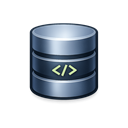
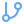

<p align="center">
  
</p>

<h1 align="center">DaTT — Database Tool</h1>

<p align="center">
  <strong>Cliente de banco de dados desktop multiplataforma com suporte a 8 engines</strong>
</p>

<p align="center">
  <em>Browse schemas, edite dados, execute queries, compare estruturas e monitore servidores — tudo em uma interface</em>
</p>

<p align="center">
  <a href="https://dotnet.microsoft.com/"></a>
  <a href="https://avaloniaui.net/"></a>
  <a href="https://github.com/CommunityToolkit/dotnet"></a>
  <a href="https://github.com/MatheusANBS/DaTT/blob/main/LICENSE"></a>
</p>

<p align="center">
  <a href="https://github.com/MatheusANBS/DaTT/releases"></a>
  <a href="https://github.com/MatheusANBS/DaTT/releases/latest"></a>
  <a href="https://github.com/MatheusANBS/DaTT/actions"></a>
  <a href="https://github.com/MatheusANBS/DaTT/releases/latest"></a>
</p>

---

<p align="center">
  
  
</p>

<p align="center">
  <em>Connection Manager com suporte a SSL e SSH Tunnel &bull; Data Grid com edição inline e exportação</em>
</p>

---

##  Início Rápido

```bash
1. Baixe o instalador na página de Releases

# https://github.com/MatheusANBS/DaTT/releases/latest

2. Execute DaTT-Setup-x.x.x.exe

Instalação por usuário — não requer admin

3. Pronto! Conecte ao seu banco de dados
```

**Primeira conexão:**

1. Clique em **New Connection** no Object Explorer
2. Selecione o engine, preencha host, porta, usuário e senha
3. Clique em **Test Connection** → **Connect**

---

##  Por que DaTT?

|  **Antes**                                                 |  **Agora**                           |
| --------------------------------------------------------------------------------------------------------------------- | ----------------------------------------------------------------------------------------------- |
|  Uma ferramenta para cada banco                           |  **1 app para todos os engines** |
|  Trocar entre MySQL Workbench, pgAdmin, Redis Insight... |  **Tudo em abas na mesma janela**   |
|  Instalar e configurar N clientes                          |  **Instalação de um clique**          |
|  Sem comparação de schemas                                 |  **Schema Diff integrado**           |
|  Monitoramento externo                                   |  **Server Monitor embutido**     |

---

##  Engines Suportados

| Engine        | Prefixo de Conexão                                 |
| ------------- | -------------------------------------------------- |
| PostgreSQL    | `postgresql://`, `postgres://`                     |
| MySQL         | `mysql://`                                         |
| MariaDB       | `mariadb://`                                       |
| Oracle        | `jdbc:oracle:thin:`                                |
| MongoDB       | `mongodb://`, `mongodb+srv`                        |
| Redis         | `redis://`                                         |
| ElasticSearch | `elasticsearch://`, `es://`, `http://`, `https://` |
| Hive          | `jdbc:hive2`                                       |

---

##  Funcionalidades em Destaque

###  Object Explorer

<p align="center">
  
</p>

- Árvore hierárquica: databases, schemas, tabelas, views, procedures, functions, triggers, users
- Lazy-loading dos filhos ao expandir
- Context menu: abrir, truncar, drop, dump, copiar nome, ver source

---

###  Data Grid

<p align="center">
  
</p>

- Navegação paginada com tamanho de página configurável
- Edição inline — rastreia linhas modificadas, inseridas e deletadas para commit em lote
- Células JSON com preview e editor modal dedicado
- Filtros, ordenação e exportação: **CSV, JSON, SQL INSERT, XLSX**

---

###  Query Editor

<p align="center">
  
</p>

- Syntax highlighting e autocomplete (keywords, tabelas, colunas)
- Executar seleção ou script completo
- Histórico de queries
- Preview de resultados configurável (100–5000 linhas)
- Formatação de SQL

---

###  Schema Diff

<p align="center">
  
</p>

- Compara duas tabelas lado a lado — colunas, índices e foreign keys
- Gera scripts `ALTER TABLE` para reconciliar diferenças e permite aplicar direto

---

###  Server Monitor

<p align="center">
  
</p>

- Dashboard em tempo real: latência ping, contagem de conexões, query stats
- Métricas específicas por engine
- Auto-refresh com intervalo configurável

---

###  Redis Console

<p align="center">
  
</p>

- Execute comandos Redis com histórico
- Inspecione key types, TTL, renomeie keys, selecione databases
- Visualização de métricas do servidor

---

###  ElasticSearch Console

<p align="center">
  
</p>

- Console HTTP: GET, POST, PUT, DELETE com body JSON
- Gerenciamento de índices
- Resposta formatada com highlighting

---

###  SSH Workspace

<p align="center">
  
</p>

- File explorer remoto via SFTP (upload, download, criar pastas)
- Execução de comandos via terminal SSH
- Port forwarding para tunelamento a bancos remotos

---

###  Auto-Update

-  Detecta nova versão no GitHub Releases ao iniciar
-  Indicador visual na barra inferior quando há atualização
-  Download com barra de progresso em tempo real
-  Instalação silenciosa — sem precisar de admin
-  App fecha e reabre automaticamente atualizado

---

##  Atalhos de Teclado

<details>
<summary><strong>Clique para ver todos os atalhos</strong></summary>

| Atalho       | Ação             | Contexto     |
| ------------ | ---------------- | ------------ |
| `Ctrl+T`     | Nova aba         | Global       |
| `Ctrl+W`     | Fechar aba       | Global       |
| `F5`         | Executar query   | Query Editor |
| `Ctrl+Enter` | Executar seleção | Query Editor |
| `Ctrl+Space` | Autocomplete     | Query Editor |
| `Ctrl+E`     | Exportar         | Data Grid    |
| `Ctrl+R`     | Refresh          | Data Grid    |
| `Delete`     | Deletar linha    | Data Grid    |

</details>

---

##  Tech Stack

```
┌─────────────────────────────────────────────────────────┐
│                        DaTT                             │
├─────────────────────────────────────────────────────────┤
│  UI Layer                                               │
│  ┌───────────────┐  ┌──────────────┐  ┌──────────────┐  │
│  │ Avalonia 11.3 │  │ AvaloniaEdit │  │ GamerTheme   │  │
│  │ (FluentTheme) │  │ (Code Editor)│  │ (VS Code dark│  │
│  └───────────────┘  └──────────────┘  └──────────────┘  │
├─────────────────────────────────────────────────────────┤
│  MVVM Layer                                             │
│  ┌─────────────────────────────────────────────────────┐│
│  │       CommunityToolkit.Mvvm 8.4                     ││
│  │   (ObservableObject, RelayCommand, generators)      ││
│  └─────────────────────────────────────────────────────┘│
├─────────────────────────────────────────────────────────┤
│  Providers                                              │
│  ┌──────────┐ ┌──────────┐ ┌──────────┐ ┌────────────┐  │
│  │ Npgsql   │ │MySqlConn.│ │ Oracle   │ │ MongoDB    │  │
│  └──────────┘ └──────────┘ └──────────┘ └────────────┘  │
│  ┌──────────┐ ┌──────────┐ ┌──────────┐ ┌────────────┐  │
│  │ SE.Redis │ │ SSH.NET  │ │ClosedXML │ │ HttpClient │  │
│  └──────────┘ └──────────┘ └──────────┘ └────────────┘  │
├─────────────────────────────────────────────────────────┤
│  .NET 8.0                                               │
└─────────────────────────────────────────────────────────┘
```

| Camada          | Tecnologia                               |
| --------------- | ---------------------------------------- |
| Runtime         | .NET 8.0                                 |
| UI              | Avalonia 11.3                            |
| MVVM            | CommunityToolkit.Mvvm 8.4                |
| DI              | Microsoft.Extensions.DependencyInjection |
| Code Editor     | AvaloniaEdit                             |
| PostgreSQL      | Npgsql 10.0                              |
| MySQL / MariaDB | MySqlConnector 2.5                       |
| Oracle          | Oracle.ManagedDataAccess.Core 23.26      |
| MongoDB         | MongoDB.Driver 3.7                       |
| Redis           | StackExchange.Redis 2.9                  |
| SSH / SFTP      | SSH.NET 2024.2                           |
| Excel Export    | ClosedXML 0.104                          |

---

##  Segurança

<table>
<tr>
<td width="50%">

###  Credenciais

-  Senhas nunca em texto plano no disco
-  Perfis armazenados localmente no AppData
-  Sem telemetria, sem tracking

</td>
<td width="50%">

###  Autenticação SSH

-  Senha tradicional
-  Chave privada (PEM)
-  Suporte a passphrase
-  Port forwarding para túneis seguros

</td>
</tr>
</table>

---

##  Estrutura do Projeto

```
DaTT.sln
├── src/
│   ├── DaTT.Core/            # Interfaces, models, services (sem UI)
│   │   ├── Interfaces/        # IDatabaseProvider, ISqlDialect, IProviderFactory
│   │   ├── Models/            # ConnectionConfig, ColumnMeta, IndexMeta...
│   │   └── Services/          # ConnectionConfigService, SchemaDiffService
│   │
│   ├── DaTT.Providers/        # Implementações por engine
│   │   ├── BaseSqlProvider.cs # Lógica SQL compartilhada
│   │   ├── ProviderFactory.cs # Connection-string → provider
│   │   └── *Provider.cs       # Um arquivo por engine
│   │
│   └── DaTT.App/              # Aplicação Avalonia
│       ├── ViewModels/        # MVVM view models
│       ├── Views/             # AXAML views + code-behind
│       ├── Styles/            # GamerTheme.axaml
│       ├── Infrastructure/    # AppLog, UpdateService
│       └── Assets/            # Icons, imagens
│
└── tests/
    └── DaTT.Tests/            # Testes unitários
```

---

##  Build & Run

**Prerequisito**: [.NET 8 SDK](https://dotnet.microsoft.com/download/dotnet/8.0)

```bash
# Clone
git clone https://github.com/MatheusANBS/DaTT.git
cd DaTT

# Restore & Build
dotnet restore
dotnet build

# Run
dotnet run --project src/DaTT.App
```

---

##  Contribuição

Contribuições são bem-vindas! Abra uma issue ou pull request.

---

##  License

MIT

| Engine        | Protocol Prefix                                    |
| ------------- | -------------------------------------------------- |
| PostgreSQL    | `postgresql://`, `postgres://`                     |
| MySQL         | `mysql://`                                         |
| MariaDB       | `mariadb://`                                       |
| Oracle        | `jdbc:oracle:thin:`                                |
| MongoDB       | `mongodb://`, `mongodb+srv`                        |
| Redis         | `redis://`                                         |
| ElasticSearch | `elasticsearch://`, `es://`, `http://`, `https://` |
| Hive          | `jdbc:hive2`                                       |
